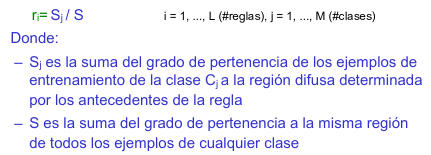

# Práctica 1: Implementación de un Algoritmo de Clasificación Difuso
### Computación Inteligente
### Máster en Ingeniería Informática

## Enunciado de la práctica

Los  SCBRDs son  otra  de  las  aplicaciones  típicas  de  los  sistemas  difusos.  Son  bien conocidos   por   su   capacidad   expresiva   o   de   interpretabilidad   frente   a   enfoques tradicionales de  clasificación  como  los  de  reglas  intervalares,  por  poder  mezclar el conocimiento aportado   por   el experto   con   el   obtenido o   aprendido por   métodos automáticos, y por su capacidad interpolativa, es decir, por hacer participar a las diferentes reglas  de  la  decisión  final  y  no  necesariamente  a una  única  regla  concreta  de  su  Base  de Conocimiento. 

Trabajaremos  con  un  conjunto  de  datos o ejemplos(dataset)  típico  de  un  repositorio reconocido, aprenderemos mediante la adaptación de un algoritmo derivado de uno de los clásicos,el  conjunto  de  reglas,  implementaremos  el  clasificador  y  verificaremos  su comportamiento,  además  de  aplicar  un  post-procesamiento  evolutivo  de  selección  de reglas para reducir el conjunto de ellas, así como para en los casos en los que se escoja un método de inferencia que haga participar múltiples reglas, un clasificador más preciso

## Planteamiento

En nuestra implementación, partimos de que el conjunto de datos a procesar ya está clasificado previamente, de forma que podemos usar parte del conjunto a modo de reglas iniciales, las cuales procesaremos y utilizaremos posteriormente para la clasificación del conjunto.

La implementación se dividirá en varios componentes:

- **Generador de etiquetas:** Divide el rango de valores de cada variable en subrangos, cada cual se corresponderá a una etiqueta.
- **Interfaz de *fuzzyficación*:** Convierte los valores discretos en etiquetas, comparando el valor con los rangos de cada etiqueta, para intentar asignar la mas apropiada
- **Particionador:** Divide el conjunto de ejemplos inicial (el fichero completo), en múltiples particiones aleatorias.
- **Generador de reglas:** Implementa el aprendizaje y la selección de las reglas, las cuales se generarán mediante la *fuzzyficacion* del conjunto de ejemplos y seleccionarán según algoritmos basados en la precisión de la regla.
- **Clasificador:** Busca la regla mas apropiada para cada ejemplo. Valida los resultados de la clasificación, comparando los datos clasificados con el conjunto inicial.

### Generación de las etiquetas

El conjunto de datos no ofrece conjuntos de etiquetas para las variables, de tal forma que no conocemos ningún criterio inicial para generar el conjunto difuso.

Así pues, generaremos las etiquetas de forma automatizada, ignorando la posible semántica de cada variable. Para ello, partiremos el rango de valores de cada variable en 3 subrangos: "Low" (bajo), "Medium" (medio), y "High" (alto). Los subrangos no serán homogéneos, sino que se basarán en los valores medios de cada variable, intentando que dicho valor medio (y valores cercanos a él) quede representado en el rango central ("Medium") de cada una.

Para realizar la división, calcularemos el valor medio de cada variable, así como su valor mínimo y máximo. La división se realizará de la siguiente manera:

- **Rango central ("Medium"):**
	+ **Límite izquierdo:** valor mínimo + (valor medio - valor mínimo)/2
	+ **Límite derecho:** valor máximo - (valor máximo - valor medio)/2
	
Los rangos izquierdo y derecho partirán del valor mínimo y máximo respectivamente, tomando como referencia para sus límites los del rango central. Para añadir algo de solapamiento a los rangos, los límites frontera con el rango central utilizarán funciones derivadas de las utilizadas para este, para conseguir que estos límites se adentren ligeramente dentro de los del rango central.

- **Rango izquierdo ("Low"):**
	+ **Límite izquierdo:** Valor mínimo
	+ **Límite derecho:** valor máximo - (valor máximo - valor mínimo)/3
	
- **Rango derecho ("High"):** 
	+ **Límite izquierdo:** valor máximo - (valor máximo - valor mínimo)/2
	+ **Límite derecho:** valor máximo
	
### Asignación de las etiquetas

Para la asignación de las etiquetas, se utilizará el grado de pertenencia, calculando dicho grado para cada posible etiqueta a la que pueda pertenecer el valor correspondiente. Tras el cálculo, se seleccionará la etiqueta con mayor grado de pertenencia.

- **Cálculo del grado de pertenencia**

	Para el cálculo del grado de pertenencia utilizaremos la siguiente función triangular [1]
	
	
	
	
	Donde *x* es el valor discreto a etiquetar, *a* es el límite inferior de la etiqueta, *b* el límite superior, y *m* el valor medio de la misma.
	
	Realizaremos este cálculo por cada posible etiqueta a la que pueda pertenecer nuestro valor. Finalmente, nos quedaremos con la etiqueta que nos ofrezca un grado de pertenencia mayor.
	
Tras asignar la etiqueta al valor, anotaremos el grado de pertenencia obtenido por la etiqueta elegida. 

### Generación de la base de reglas

Para la generación de cada regla se aplicará una *fuzzyficación* del ejemplo, convirtiendo los valores discretos de sus antecedentes, a etiquetas difusas. A cada regla se le asignará un grado de pertenencia total, que será la suma de los grados de pertenencia de las etiquetas de sus antecedentes. 

#### Selección de reglas

El clasificador, en su momento inicial, tomará el dataset completo *fuzzyficado* como base de reglas. Este dataset puede generar reglas repetidas, o con antecedentes idénticos pero distinto consecuente.

Para solucionar esto, se aplicará un filtrado en el cual, por cada conjunto de antecedentes existente en la base, se seleccionará la regla con mayor grado de certeza.

El grado de certeza se calculará según la siguiente fórmula

El valor Si lo obtendremos sumando el grado de pertenencia de todas las reglas semejantes a la actual (que coinciden tanto en antecedente como en consecuente), mientras que el S lo obtendremos sumando dicho grado en todas las reglas que comparten antecedentes con la actual (aunque tengan distinto consecuente).

Este grado se calculará de forma dinámica, según los datos del subconjunto de reglas existente en dicho momento.

#### Aprendizaje del conjunto mínimo de reglas

Para el aprendizaje de las reglas, partiremos el conjunto de datos inicial (correspondiente al fichero completo, y sin *fuzzyficar*) en 5 particiones: una para test, y el resto para entrenamiento.

El aprendizaje iterará sobre el conjunto de particiones, eligiendo en cada iteración una de ellas para el test, y el resto para entrenamiento. 

En cada iteración, el conjunto de reglas actual se enfrentará sucesivamente a las 4 particiones de entrenamiento (las cuales se *fuzzyficarán* en su correspondiente iteración), realimentándose con las reglas coincidentes obtenidas del clasificador (como conjunto de reglas inicial, se utilizará el conjunto de datos *fuzzyficado* del fichero completo). Posteriormente, invocará al algoritmo de selección de reglas para eliminar las reglas duplicadas, reduciendo el conjunto a las mejores; y dicho conjunto reducido se enfrentará a la partición de test, para calcular su precisión.

La concatenación de las reglas coincidentes con la base de reglas, permite generar una duplicidad en aquellas reglas mas utilizadas (que mas veces han coincidido), de tal manera que, al aplicar el algoritmo de selección, estas tendrán un grado de certeza superior a las no utilizadas, facilitando su selección dentro del conjunto reducido, y mejorando la precisión del clasificador.

Esto generará un conjunto de reglas mínimo, que permita obtener una precisión aceptable con un número reducido de reglas.´

### Clasificación de los ejemplos

Para la clasificación de los ejemplos, cada ejemplo se enfrentará a la base de reglas existente. Para ello, se buscarán sus antecedentes dentro de la base de reglas. De existir mas de uno, se asignará la regla coincidente que primero que se encuentre. De no existir, el ejemplo será clasificado con un tipo "comodín" (en este caso, -1) para indicar que no se ha podido clasificar. 

#### Verificación de la clasificación

Para poder verificar la precisión de la clasificación, el conjunto de ejemplos *fuzzyficado* mantendrá la columna correspondiente a la clase de su ejemplo original. El conjunto clasificado sobrescribirá dicha columna con el tipo asignado por el clasificador, o un -1 en caso de no encontrar una regla coincidente. 

Finalmente, en la verificación se comparará el conjunto *fuzzyficado* original con el conjunto clasificado, buscando las columnas comunes entre ambos, y viendo cuántas del conjunto original coinciden con las del clasificado. Esto nos permitirá obtener el valor TP (verdaderos positivos), para poder calcular la precisión del clasificador.

Esta verificación también devolverá el conjunto de ejemplos coincidentes, obtenidas de dicha comparación, que se utilizarán como reglas para la realimentación del generador de reglas. Para ello, también se mantendrá la columna correspondiente al Grado de Pertenencia, que se utilizará para el algoritmo del selección de reglas.

## Implementación

### Lenguaje de programación a utilizar

Para la implementación, utilizaremos el lenguaje de programación Python, en su versión 3. Para la lectura y el procesamiento de los conjuntos de datos, utilizaremos la librería pandas, que permite la lectura de los datos de ficheros basados en filas y columnas, de forma sencilla, asociando cada columna a su nombre; y permitiendo realizar operaciones sobre el conjunto, tanto a nivel de fila y columna, como del conjunto completo

También se podrá utilizar NumPy para ciertas operaciones puntuales, como el particionado del conjunto de datos.

### Ficheros

El proyecto se compone de varios ficheros:

- **main.py** : fichero principal, que pone en marcha el clasificador
- **gen_tags.py** : Generador de etiquetas. Genera las etiquetas para cada variable
- **fuzzifier.py**: Interfaz de *fuzzyficación*. Convierte conjuntos de datos con valores discretos en conjuntos difusos, transformando cada valor en una etiqueta.
- **partitioner.py**: Particionador. Divide el conjunto de datos en 5 particiones aleatorias.
- **rules_gen.py**: Generador de reglas. Utiliza la interfaz de *fuzzyficación* para obtener el conjunto de reglas inicial a partir del dataset completo, e implementa los algoritmos para el entrenamiento y la selección de las reglas.
- **classifier.py**: Clasificador. Utiliza el conjunto de reglas para asignar una clase a cada ejemplo del conjunto de datos, y verifica la precisión de dicha clasificación. 

### Clases y métodos

#### Generador de etiquetas

Implementado en la clase `genTags`. Se compone de los siguientes métodos:

- `__init__(self, df)`: Constructor. Recibe como parámetro el dataframe del conjunto de datos a procesar
- `calculate_column_means()`: Calcula la media aritmética de cada columna del dataframe
- `calculate_tag_ranges(mean_df, var_name)`: Calcula los rangos de valores de las etiquetas de cada variable. Recibe por parámetro el dataframe con el valor medio de cada columna/variable, y el nombre de la variable a etiquetar. Devuelve un diccionario con los valores mínimos y máximos de cada etiqueta.
- `set_tags()`: Invoca la generación de las etiquetas para cada variable del conjunto de datos. Devuelve un diccionario con los diccionarios de etiquetas de cada variable.

#### Interfaz de *fuzzyficación*

Implementado en la clase `Fuzzifier`. Se compone de los siguientes métodos:

- `__init__(df)`: Constructor. Recibe por parámetro el dataframe con el conjunto de datos a transformar  

- `calculate_owning_degree(value, tag_range)`: Método auxiliar. Calcula el grado de pertenencia de un valor a una etiqueta. Recibe por parámetro la lista de valor mínimo y máximo de dicha etiqueta, y el valor para el que se quiere calcular. Devuelve el grado de pertenencia de dicho valor.  

- `select_tag_for_value(value, tags_ranges)`: Método auxiliar. Selecciona la mejor etiqueta para un valor discreto. Recibe por parámetro el valor discreto y el diccionario con los rangos de cada etiqueta. Devuelve la etiqueta asignada y el grado de pertenencia a dicha etiqueta.  

- `select_tag_for_data(value, tags_ranges)`: Método auxiliar. Similar al anterior, utilizado en la *fuzzificación* de un valor de un conjunto de datos. Invoca al método anterior, ignorando el valor del grado de pertenencia devuelto por el mismo. Devuelve la etiqueta asignada al valor.

- `calculate_rule_owning_degree(rule)`: Método auxiliar. Calcula el grado de pertenencia total de una etiqueta, a partir del grado de pertenencia de sus antecedentes. Recibe por parámetro la fila de la regla a calcular. Añade a dicha fila una nueva columna con el grado de pertenencia. Devuelve la fila modificada con la nueva columna.  

- `fuzzify_rules(tags_ranges)`: Transforma un conjunto de ejemplos discreto en un conjunto de reglas difuso. Utiliza los métodos anteriores para asignar una etiqueta a cada valor discreto de cada ejemplo, excepto a la clase consecuente, que simplemente se copia. Añade una nueva columna con el grado de pertenencia total de cada regla. Recibe por parámetro el diccionario con las etiquetas de cada variable. Devuelve un dataframe con los ejemplos transformados en reglas difusas. 

- `fuzzify_data(tags_ranges)`: Similar al anterior, pero para conjuntos de datos (para clasificar). Realiza la misma labor que el anterior, pero ignorando el grado de pertenencia en el conjunto resultante (no añade dicha columna).

#### Particionador

Implementado en la clase `Partitioner`. Se compone de los siguientes métodos:

- `__init__(df)`: Constructor. Recibe por parámetro el dataframe con el conjunto de datos a particionar.
- `gen_partition_set()`: Divide el dataframe en 5 dataframe aleatorios, reordenando el dataframe de forma aleatoria y dividiéndolo en 5 particiones. Devuelve una lista con el dataframe de cada partición. 

#### Generador de reglas

Implementado en la clase `RulesGenerator`. Se compone de los siguientes métodos:

- `__init__(df)`: Constructor. Recibe por parámetro el dataframe del conjunto de datos que queremos utilizar de base para las reglas.
- `get_initial_rules(examples_df, tags_ranges)`: Genera un conjunto de reglas a partir de un conjunto de ejemplos. Recibe por parámetro el dataframe con el conjunto de ejemplos (sin *fuzzificar*) e invoca a la interfaz de *fuzzificación* para transformarlo en un conjunto de reglas. Devuelve el dataframe con el conjunto de reglas generado.
- `_calculate_certainty_degree(rule, rules_gr)`: Método auxiliar. Dado un grupo de reglas con antecedentes comunes, calcula el grado de certeza de la regla indicada. Recibe por parámetro la regla de la que queremos calcular su grado de certeza, y el grupo de reglas con antecedentes comunes al que pertenece. Añade a la fila de la regla indicada una nueva columna con el grado de certeza, y devuelve la fila modificada con la nueva columna.
- `reduce_rules(rules_df, tags_ranges, initial=True)`: Reduce el conjunto de reglas, seleccionando una única regla por cada conjunto de antecedentes. Calcula el grado de certeza de cada regla en función del resto de reglas existentes en el conjunto actual, y selecciona la regla con mayor grado de certeza dentro de cada grupo de antecedentes comunes. Recibe por parámetro el dataframe del conjunto de reglas, y el diccionario de etiquetas con los rangos de cada variable. En caso de indicar `initial=False`, el conjunto de reglas se generará desde el principio, invocando a `get_initial_rules()` para *fuzzificar* el conjunto de ejemplos indicado en `rules_df`. Devuelve el dataframe con el conjunto de reglas ya reducido.
- `start_rules_training()`: Aplica el algoritmo de entrenamiento para mejorar el aprendizaje de las reglas. Implementa todo el proceso de división del conjunto de datos en particiones, obtención del conjunto de reglas iniciales para entrenamiento, y enfrentamiento del conjunto de reglas a cada partición de entrenamiento y comprobación con la de test. Devuelve el conjunto de reglas mínimo obtenido.

#### Clasificador

Implementado en la clase `Classifier`. Se compone de los siguientes métodos:

- `_init__(fuzzy_df, rules_df)`: Constructor. Recibe por parámetro el conjunto difuso a clasificar y la base de reglas que se utilizará para la clasificación.
- `select_type(row)`: Método auxiliar. Utiliza la base de reglas para seleccionar la clase mas adecuada para dicho ejemplo, en base a sus antecedentes. Recibe por parámetro la fila del ejemplo a clasificar. Devuelve la fila de la regla seleccionada, en caso de encontrar una regla coincidente. En caso contrario,  devuelve la misma fila añadiendo las columnas `Type` (clase) y `Owning Degree` (grado de pertenencia) puestas a -1 y 0 respectivamente.
- `classify_dataset()`: Clasifica el conjunto difuso, seleccionando la mejor clase para cada ejemplo. Devuelve el conjunto difuso clasificado.
- `verify_classification()`: Verifica el resultado de la clasificación, comparando la clase de los ejemplos del conjunto difuso inicial, con la clase del conjunto difuso ya clasificado. Calcula la tasa de positivos, midiendo el número de filas coincidentes entre ambos conjuntos. Devuelve el conjunto de ejemplos coincidentes y la tasa de positividad.

### Ejecución

#### Instalación de dependencias

Para la instalación de las dependencias, se provee un fichero de requisitos, que indica las librerías necesarias.
Podemos instalarlas con:

	pip install -r requirements.txt

#### Ejecución del clasificador

Iniciamos el clasificador ejecutando el fichero `main.py`, que contiene las instrucciones necesarias para cargar el fichero de datos e iniciar la clasificación. Para ello, podemos abrir una terminal y, desde dentro del directorio del proyecto, ejecutar el siguiente comando:

	python3 main.py

Esto iniciará la clasificación del conjunto de datos "glass.csv", presente en el mismo directorio. La ejecución tardará unos segundos. La versión csv de Glass-1 se ha obtenido desde aquí: https://raw.githubusercontent.com/p-sama/Glass-Classification/master/glass.csv

#### Resultados

El programa mostrará por pantalla unos valores similares a estos:  

	Test 0 accuraccy: 0.7674418604651163
	Test 1 accuraccy: 0.627906976744186
	Test 2 accuraccy: 0.627906976744186
	Test 3 accuraccy: 0.7674418604651163
	Lenght of minimal rules set: 61
	Full dataset accuraccy: 0.6915887850467289

Las primeras 4 líneas indican la precisión de la clasificación de los 4 conjuntos de test durante el aprendizaje de las reglas. La siguiente indica el número de reglas almacenadas en el conjunto mínimo generado. Y, finalmente, la última indica la precisión de la clasificación del dataset completo con el conjunto mínimo de reglas.

Vemos como la precisión ronda entre un 60% y un 80%. La precisión sobre el conjunto completo ha sido del 69%.

Tras las medidas de precisión, se nos mostrará el conjunto mínimo de reglas generado por el clasificador. En este caso, constará de 61 reglas.

	Minimal rules set: 
	       RI      Na      Mg      Al      Si       K    Ca      Ba      Fe Type  Owning Degree
	189  High    High  Medium  Medium     Low     Low   Low    High     Low    7       3.917874
	106  High     Low     Low    High     Low     Low  High     Low    High    2       3.028930
	110  High     Low     Low     Low    High     Low  High     Low     Low    2       1.292102
	105  High     Low     Low  Medium  Medium  Medium  High     Low    High    2       2.454924
	103  High  Medium    High     Low     Low     Low  High     Low     Low    2       1.894259
	104  High  Medium    High     Low     Low     Low   Low     Low     Low    2       2.267084
	50   High  Medium    High     Low  Medium     Low   Low     Low     Low    1       2.262152
	47   High  Medium    High     Low  Medium     Low   Low     Low  Medium    1       2.146947
	112  High  Medium     Low     Low  Medium     Low  High     Low     Low    2       1.081060
	170  High  Medium     Low  Medium  Medium     Low  High     Low     Low    5       1.680581
	131  High  Medium     Low  Medium  Medium     Low  High     Low  Medium    2       2.268321
	186   Low    High    High    High  Medium  Medium   Low    High     Low    7       3.943295
	84    Low    High    High    High  Medium  Medium   Low     Low     Low    2       3.331216
	162   Low    High    High     Low  Medium     Low   Low     Low    High    3       2.641021
	17    Low    High    High     Low  Medium     Low   Low     Low     Low    1       1.979599
	70    Low    High    High  Medium  Medium     Low   Low     Low  Medium    2       3.037260
	182   Low    High     Low    High    High     Low  High     Low     Low    6       1.913583
	193   Low    High     Low    High    High     Low   Low    High     Low    7       3.342616
	194   Low    High     Low    High    High     Low   Low     Low     Low    7       2.826269
	195   Low    High     Low    High    High     Low   Low  Medium     Low    7       2.505217
	191   Low    High     Low    High    High     Low   Low  Medium  Medium    7       2.896894
	108   Low    High     Low     Low    High     Low  High     Low     Low    2       2.280899
	205   Low    High     Low  Medium    High     Low   Low     Low     Low    7       2.057090
	207   Low    High     Low  Medium    High  Medium   Low    High     Low    7       2.907937
	181   Low    High     Low  Medium  Medium     Low   Low     Low     Low    6       1.860848
	188   Low    High  Medium    High     Low     Low   Low     Low     Low    7       2.798994
	179   Low    High  Medium  Medium    High     Low   Low     Low     Low    6       2.418753
	178   Low    High  Medium  Medium  Medium     Low   Low     Low     Low    6       2.362397
	201   Low     Low     Low     Low    High     Low   Low     Low     Low    7       2.694319
	184   Low     Low     Low     Low     Low     Low   Low     Low     Low    6       1.018677
	166   Low     Low     Low  Medium    High     Low  High     Low     Low    5       3.044043
	165   Low     Low  Medium  Medium    High     Low  High     Low     Low    5       3.056447
	79    Low  Medium    High    High    High     Low   Low     Low     Low    2       2.830659
	44    Low  Medium    High     Low    High     Low   Low     Low    High    1       3.600523
	6     Low  Medium    High     Low    High     Low   Low     Low     Low    1       2.644313
	59    Low  Medium    High     Low    High     Low   Low     Low  Medium    1       3.366681
	163   Low  Medium    High     Low     Low  Medium   Low    High     Low    5       3.206086
	18    Low  Medium    High     Low  Medium     Low   Low     Low     Low    1       2.174115
	62    Low  Medium    High     Low  Medium     Low   Low     Low  Medium    1       2.546647
	5     Low  Medium    High  Medium    High     Low   Low     Low    High    1       3.507115
	1     Low  Medium    High  Medium    High     Low   Low     Low     Low    1       2.563575
	9     Low  Medium    High  Medium    High     Low   Low     Low  Medium    1       3.345035
	185   Low  Medium    High  Medium    High  Medium   Low     Low     Low    7       3.237526
	71    Low  Medium    High  Medium  Medium     Low   Low     Low    High    2       3.228634
	76    Low  Medium    High  Medium  Medium     Low   Low     Low     Low    2       2.501961
	113   Low  Medium    High  Medium  Medium     Low   Low     Low  Medium    2       3.532788
	61    Low  Medium    High  Medium  Medium     Low   Low  Medium     Low    1       3.106599
	196   Low  Medium     Low    High    High     Low   Low  Medium     Low    7       2.423113
	171   Low  Medium     Low    High     Low     Low   Low     Low     Low    5       1.567384
	174   Low  Medium     Low    High  Medium     Low   Low     Low     Low    5       3.128767
	109   Low  Medium     Low     Low    High     Low  High     Low     Low    2       1.187891
	107   Low  Medium     Low     Low     Low     Low   Low     Low     Low    2       1.907750
	0     Low  Medium     Low     Low  Medium     Low   Low     Low     Low    1       1.811790
	175   Low  Medium     Low  Medium    High     Low  High     Low    High    5       2.946814
	167   Low  Medium     Low  Medium    High     Low  High     Low     Low    5       1.835061
	168   Low  Medium     Low  Medium    High  Medium   Low     Low     Low    5       1.793448
	130   Low  Medium     Low  Medium  Medium     Low  High     Low     Low    2       2.627260
	129   Low  Medium     Low  Medium  Medium     Low   Low     Low     Low    2       3.290390
	164   Low  Medium  Medium  Medium    High     Low   Low     Low     Low    5       2.580344
	190   Low  Medium  Medium  Medium    High     Low   Low  Medium     Low    7       3.321530
	128   Low  Medium  Medium  Medium  Medium     Low   Low     Low     Low    2       3.775387

El índice indica la posición de la fila en el conjunto original. Podemos apreciar la aleatoriedad del orden del conjunto.
También, prestando un poco de atención al conjunto de reglas, podemos comprobar como no existen dos reglas con los mismos antecedentes. 

## Análisis

Tras la repetición de los experimentos, obtenemos unas precisiones medias de entre 65% y 80%, los cuales se pueden considerar bastante satisfactorios. La precisión sobre el conjunto final es de un 69%.

Haciendo diferentes pruebas, notamos como el algoritmo de selección de reglas tiene mas impacto en la precisión que el propio proceso de entrenamiento contra las 4 particiones de entrenamiento. 

- Desactivando el bucle que enfrenta el conjunto de reglas a las 4 particiones de entrenamiento, dejando únicamente el filtrado previo al test, los resultados se mantienen muy similares, de entre un 62% y un 86% de precisión mínima y máxima, aunque la moda está entre el 70% y el 80% de precisión.  La precisión sobre el conjunto final es de un 71%.

- Desactivando el algoritmo de selección de reglas, la precisión baja a valores de moda de entre un 50% y un 72%. Y la precisión sobre el conjunto final baja a alrededor de un 65%.  

- Desactivando todo el proceso de aprendizaje (entrenamiento y selección de reglas), y dejando únicamente el conjunto inicial, la precisión sobre el conjunto final baja a un 65%.  

- Moviendo la selección de reglas al bucle de entrenamiento, la precisión varía entre un 53% y un 81%, con valores de moda de 67% y 74%.  La precisión sobre el conjunto final es de un 69%.

### Tabla resumen

|| Precisión mínima (%) | Precisión máxima (%) | Precisión conjunto final (%) | Precisión moda (%) |
|-- |-- | -- | -- | -- |
| Con entrenamiento y selección de reglas | 65 | 80 | 69 | N/A
| Sin bucle de entrenamiento | 62 | 86 | 71 | 70 - 80 |
| Sin selección de reglas | 50 | 72 | 65 | N/A
 | Sin aprendizaje | N/A | N/A | 65 | N/A
 | Selección de reglas durante entrenamiento | 53 | 81 | 69 | 67 - 74 

## Problemas encontrados

La versión actual tiene un consumo de recursos elevado, especialmente en el caso de la memoria. Esto nos ha impedido ejecutar el clasificador sobre el fichero de datos CovType. Aunque el diseño del programa permite su ejecución, el consumo elevado de memoria que supone supera los recursos de nuestro equipo informático (16 GB de RAM)

### Mejoras

Aplicando ciertas modificaciones, se ha logrado reducir considerablemente el consumo de memoria. 

- **Conversión de la representación de las etiquetas a tipo int8:** La representación de las etiquetas mediante cadenas de caracteres supone un consumo elevado de memoria. Cambiando dicha representación por una basada en números enteros de 8 bits, se puede reducir dicho consumo, además de simplificar el procesamiento. 

- **Establecimiento a tipo _None_ de las estructuras que han dejado de utilizarse:** Esto permite que el recolector de basura los identifique mas rápidamente, permitiendo liberar sus recursos.

- **Invocación manual del recolector de basura : ** Invocando a dicho recolector manualmente, aceleramos la liberación de los recursos de memoria, ralentizando el aumento del consumo del memoria, y reduciendo el consumo global. 

Con dicha versión, el consumo de memoria con el conjunto de datos CovType se reduce a 5 GB de pico. Aunque aún los tiempos de acceso a memoria ralentizan en gran medida la ejecución, cuya primera iteración de entrenamiento no llegó a terminar tras 3 horas de ejecución. 

Dicha versión se puede descargar en la rama wip del [repositorio del proyecto](https://github.com/AlmuHS/FuzzyClasifier_Exercise/tree/wip
)

### Otras mejoras

Como otra posible mejora, se ha intentado compilar el proyecto en C, utilizando para ello la herramienta `nuitka`. Por desgracia, el consumo de memoria se ha mantenido elevado, y no se ha apreciado una mejora notable en los tiempos de ejecución.

### Posibles soluciones

Para solucionar este problema, se plantean varias alternativas:

- **Reemplazo de la librería Pandas por NumPy: ** Pandas es una librería muy versátil, pero por desgracia obliga a realizar muchas copias del dataframe durante el procesamiento, lo cual puede elevar fácilmente el consumo de memoria. NumPy permite operar con matrices y arrays numéricos, ofreciendo una mayor escalabilidad en este tipo de operaciones. Por esta razón, el cambio a esta librería podría mejorar el consumo de memoria.

- **Reimplementación del proyecto en C++:** Python incluye muchas librerías para el procesamiento de conjuntos de datos de forma sencilla. Por desgracia, su ejecución supone unos tiempos mas elevados, además de que su gestión de memoria puede ser problemática en casos como este. C++ permite una gestión mas fina de la memoria, liberando recursos en cuánto termina su ámbito de ejecución, e incluso permitiendo la liberación manual de los recursos del *heap*. Esto podría ayudar a reducir el consumo de memoria de nuestro programa. A cambio, la implementación podría resultar bastante mas complicada, requiriendo mas tiempo de desarrollo para la misma.

## Conclusiones

La implementación del clasificador, aunque simple, resulta bastante eficaz, obteniendo buenos resultados de precisión, con un conjunto de reglas bastante reducido (61 reglas de 215 ejemplos). Incluso, se ha logrado mejorar ligeramente la precisión respecto al conjunto de reglas basado en el dataset completo.

Esta implementación ha supuesto varios desafíos, como pudieran ser la generación de las particiones de las etiquetas, la selección de la etiqueta mas apropiada para un valor discreto (en caso de que perteneciera al rango de valores de varias de ellas), y la reducción del conjunto de reglas mediante un algoritmo de selección para reglas con  antecedentes comunes. Estos se han solucionado mediante el uso de algorítmica sencilla y ciertos cálculos matemáticos. 

Aunque no se ha implementado la reducción de variables dentro de las reglas (todas las reglas utilizan todas las variables del conjunto), el resultado es bastante positivo. Para la reducción de reglas se han probado múltiples enfoques, como la selección del consecuente mas repetido, o la selección de las reglas con mayor grado de certeza; aunque finalmente hemos optado por este último. Esto nos ha asegurado tener una única regla por cada conjunto de antecedentes, a la vez que mantenemos una gran fidelidad en la selección de dicha regla, evitando la reducción de precisión del clasificador.

A nivel general, la parte mas complicada ha sido entender los algoritmos y el procedimiento a seguir, mas aún que la propia implementación de la práctica que, aunque laboriosa, ha sido relativamente sencilla. La falta de comprensión de algunos de los algoritmos, ha obligado a realizar varias refactorizaciones durante el desarrollo del proyecto, que iba modificándose conforme se iban descubriendo nuevos detalles de cada algoritmo.

En definitiva, es una práctica relativamente simple de implementar, pero con unos planteamientos algo difíciles de entender.

## Referencias

- \[1\] [
Tutorial de Introducción de Lógica Borrosa -  Mª Ángeles Olmo Castillo
](http://www.dma.fi.upm.es/recursos/aplicaciones/logica_borrosa/web/tutorial_fuzzy/contenido3.html)

